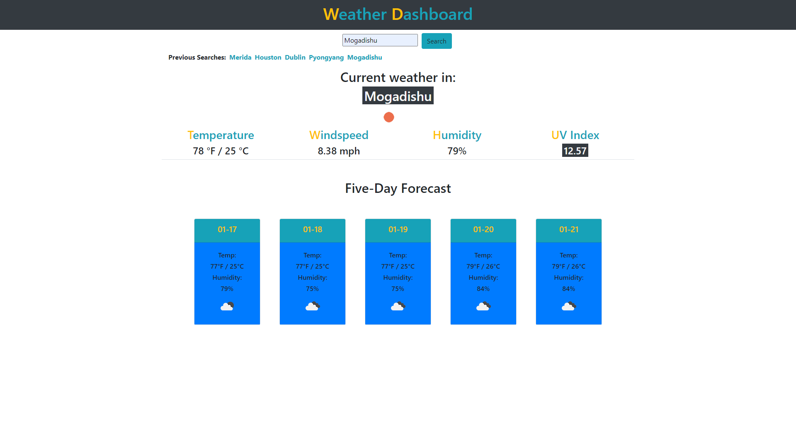
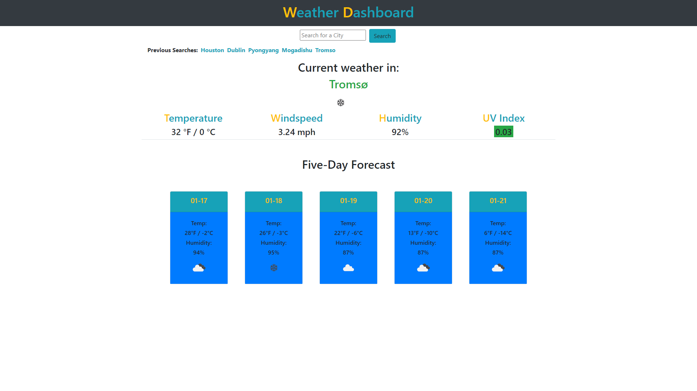

# Weather Dashboard
## Description
This weather application provides you with current forecasts for your city of choice, powered by Open Weather Map. 
Simply search for your city, and you'll be provided with the location's: 
* Temperature
* Windspeed
* Humidity
* Color-coded UV Index
   * (0-3: Green, 3-6 Yellow, 6-10 Red, 10+ Black)
* Five-Day Forecast
## Built With
* HTML
* JavaScript
    * JQuery
* CSS
    * Bootstrap
## Website
https://jpkashlak.github.io/weather-dashboard/
## Preview

